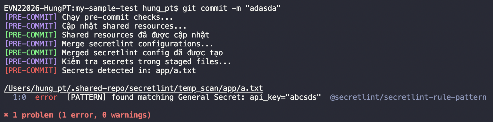

# Template Repository with Shared Resources & Secret Detection

This template repository provides automated setup for shared resources synchronization and secret detection using pre-commit hooks.

## 🚀 Quick Start

### Prerequisites

- **Node.js v20+** (required for secretlint)
- **Git** (for repository operations)
- **npm** (for dependency management)

### Initial Setup on your repository

1. **Run the setup script:**
   ```bash
   ./setup.sh
   ```

2. **Verify the setup:**
   ```text
      ==================================================
      [SUCCESS] SETUP HOÀN THÀNH THÀNH CÔNG!
      ==================================================

      Những gì đã được thiết lập:
      ✅ Node.js ≥v20
      ✅ Shared repository tại /Users/hung_pt/.shared-repo
      ✅ Shared resources tại .github/shared
      ✅ Custom secretlint config tại .vscode/custom.secretlintrc.json
      ✅ Secretlint tools tại /Users/hung_pt/.shared-repo/secretlint
      ✅ Merged config tại /Users/hung_pt/.shared-repo/secretlint/.secretlintrc.json
      ✅ Git pre-commit hook

      Từ bây giờ, mỗi lần commit sẽ:
      • Cập nhật shared resources và secretlint tools
      • Merge secretlint configurations
      • Kiểm tra secrets trong code changes only
      • Ngăn commit nếu phát hiện secrets
   ```

3. **Update custom secretlint rules (if any) at:**
   ```text
   .vscode/custom.secretlintrc.json
   ```   

### Usage

Everytime you make a commit, the pre-commit hook will automatically:
- Synchronize shared resources from the template repository.
- Run secretlint to detect any secrets in your code.



**Happy coding! 🚀**
