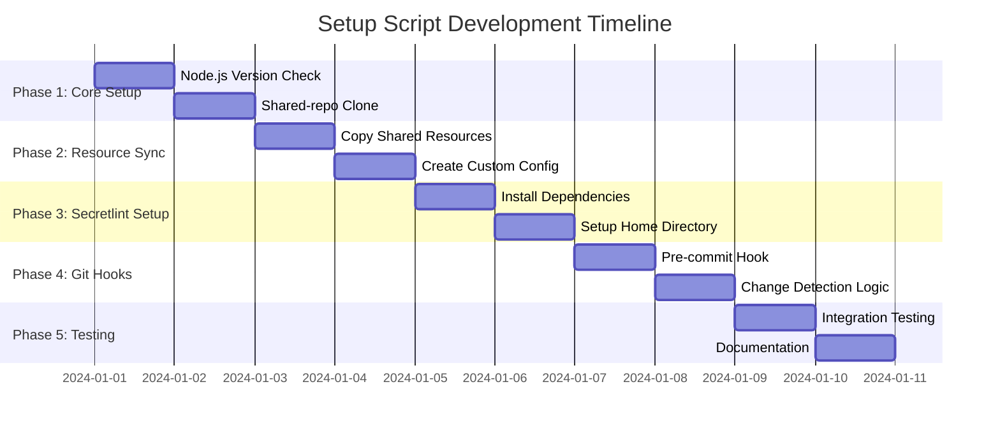
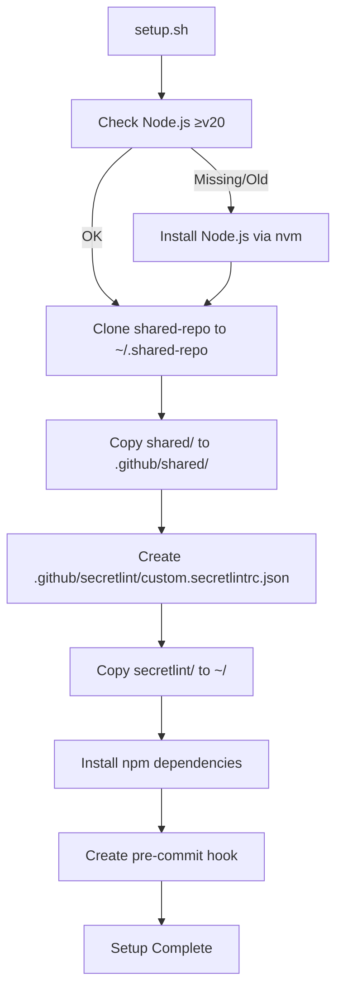
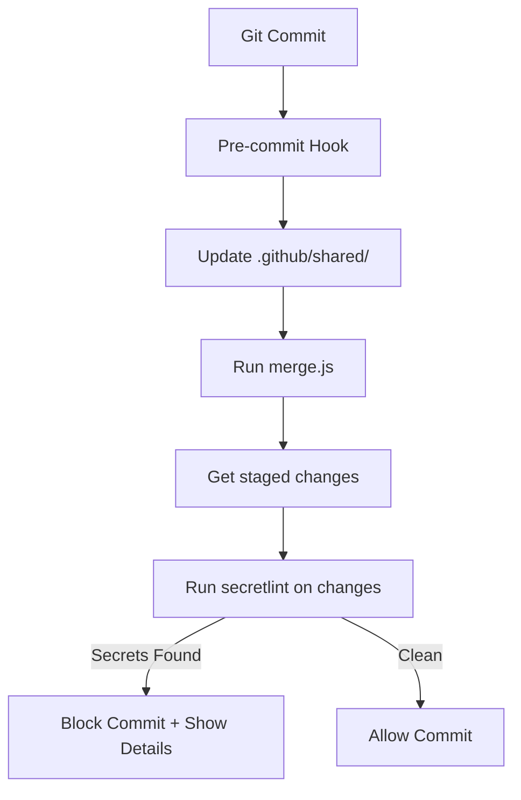

# PHÂN TÍCH DỰ ÁN: SETUP SCRIPT CHO SHARED RESOURCES VÀ SECRETLINT

## 🎯 MỤC TIÊU DỰ ÁN

**Mục tiêu chính:** Tạo hệ thống setup tự động cho việc chia sẻ resources và kiểm tra bảo mật code thông qua secretlint integration.

**Mục tiêu phụ:**
- Đồng bộ hóa shared resources từ central repository
- Thiết lập secretlint để ngăn chặn secrets trong code
- Tự động hóa quy trình kiểm tra pre-commit
- Đảm bảo consistency across multiple projects

## 📋 PHẠM VI DỰ ÁN

### Trong phạm vi:
1. **Setup Script Development**
   - Tạo `setup.sh` với đầy đủ functionality
   - Node.js version checking (≥v20)
   - Automatic dependency installation

2. **Repository Management**
   - Clone shared-repo vào `~/.shared-repo`
   - Sync shared resources vào `.github/shared`
   - Update mechanism cho shared content

3. **Secretlint Integration** 
   - Setup secretlint trong home directory (~)
   - Tạo custom configuration file
   - Merge default và custom rules bằng merge.js

4. **Git Hooks Implementation**
   - Pre-commit hook for automated checks
   - Code changes scanning only
   - Prevent commits with secrets

### Ngoài phạm vi:
- CI/CD pipeline configuration
- Multi-platform compatibility testing  
- GUI tools development
- Performance optimization

## 🛠️ RÀNG BUỘC KỸ THUẬT

### Platform Requirements:
- **OS:** Unix-like systems (Linux, macOS)
- **Shell:** Bash/Zsh compatibility
- **Node.js:** Version ≥20.0.0
- **Git:** Version ≥2.0

### External Dependencies:
- GitHub repository access: `https://github.com/anboo44/shared-repo`
- Internet connectivity for initial setup
- npm package manager
- secretlint package và dependencies

### File Structure Requirements:
```
~/.shared-repo/          # Clone của shared-repo
├── shared/
├── secretlint/
└── hooks/

template-repo/
├── .github/
│   ├── shared/          # Copy từ ~/.shared-repo/shared/
│   └── secretlint/
│       └── custom.secretlintrc.json
└── .git/hooks/
    └── pre-commit       # Git hook
```

## ✅ TIÊU CHÍ NGHIỆM THU

### Functional Requirements:
1. **Setup Script:**
   - [ ] Kiểm tra và cài đặt Node.js ≥v20
   - [ ] Clone shared-repo vào `~/.shared-repo`
   - [ ] Copy shared resources vào `.github/shared`
   - [ ] Tạo `.github/secretlint/custom.secretlintrc.json`
   - [ ] Setup secretlint trong home directory
   - [ ] Tạo git pre-commit hook

2. **Secretlint Integration:**
   - [ ] Sử dụng merge.js để gộp configs
   - [ ] Detect secrets trong code changes only
   - [ ] Block commits khi phát hiện secrets
   - [ ] Không scan toàn bộ repository

3. **Sync Mechanism:**
   - [ ] Update shared resources on pre-commit
   - [ ] Handle merge conflicts gracefully
   - [ ] Maintain custom configurations

## 📊 KẾ HOẠCH THỰC HIỆN PHÂN GIAI ĐOẠN



### 🎯 MILESTONE VÀ DELIVERABLES

**Phase 1: Core Setup (2 ngày)**
- ✅ Node.js version checking và auto-install
- ✅ Shared-repo cloning mechanism

**Phase 2: Resource Sync (2 ngày)**  
- ✅ Shared resources synchronization
- ✅ Custom configuration creation

**Phase 3: Secretlint Setup (2 ngày)**
- ✅ Secretlint installation và configuration
- ✅ Merge.js integration cho config merging

**Phase 4: Git Hooks (2 ngày)**
- ✅ Pre-commit hook implementation
- ✅ Incremental scanning functionality

**Phase 5: Testing & Documentation (2 ngày)**
- ✅ Comprehensive testing
- ✅ User documentation

## ⚠️ RỦI RO TIỀM ẨN VÀ GIẢI PHÁP DỰ PHÒNG

### Rủi ro Cao

**R1: Network Connectivity Issues**
- **Mô tả:** Không thể clone/pull từ GitHub
- **Impact:** Blocking setup process
- **Giải pháp:** 
  - Retry mechanism với exponential backoff
  - Cache previous successful clone
  - Manual fallback instructions

**R2: Node.js Version Conflicts**
- **Mô tả:** System có Node.js version <20
- **Impact:** Secretlint không hoạt động
- **Giải pháp:**
  - Auto-install Node.js qua nvm
  - Version detection và upgrade guidance
  - Alternative installation methods

### Rủi ro Trung bình

**R3: Permission Issues**
- **Mô tả:** Không có quyền write vào home directory
- **Impact:** Setup failed
- **Giải pháp:**
  - Permission checking trước setup
  - Alternative installation paths
  - Clear error messages

**R4: Merge.js Configuration Conflicts**
- **Mô tả:** Conflict trong secretlint config merge
- **Impact:** Reduced detection accuracy
- **Giải pháp:**
  - Validation before merge
  - Fallback to default config
  - Detailed error logging

## 🔧 CẤU TRÚC TECHNICAL SOLUTION

### Core Components:

1. **setup.sh - Main Setup Script**
   ```bash
   #!/bin/bash
   # Environment validation
   # Node.js checking/installation
   # Shared-repo management
   # Secretlint setup
   # Git hooks creation
   ```

2. **Repository Manager**
   - Clone `shared-repo` vào `~/.shared-repo`
   - Sync shared resources
   - Handle updates và conflicts

3. **Secretlint Integration**
   - Copy secretlint folder từ `~/.shared-repo/secretlint/` về `~/`
   - Sử dụng `merge.js` để gộp configs:
     ```bash
     node ~/merge.js .github/secretlint/custom.secretlintrc.json
     ```
   - Output: `~/.secretlintrc.json`

4. **Git Hook Implementation**
   ```bash
   # Pre-commit hook workflow:
   # 1. Update shared resources
   # 2. Merge secretlint configs  
   # 3. Get changed files only
   # 4. Run secretlint on changes
   # 5. Block commit if secrets found
   ```

### Setup Workflow:



### Pre-commit Hook Workflow:



## 📝 CẬP NHẬT YÊU CẦU MỚI

### Thay đổi Location:
- **Cũ:** Clone vào `.my-temp`
- **Mới:** Clone vào `~/.shared-repo`

### Merge.js Integration:
- Sử dụng `node merge.js <external-config-path>` để gộp configs
- External config: `.github/secretlint/custom.secretlintrc.json`
- Output: `~/.secretlintrc.json`
- Hỗ trợ intelligent pattern merging

### Advanced Features:
- Deep merge rule options
- Duplicate pattern handling với OR operator
- Preserve unique patterns
- Error handling chi tiết

---

**Phân tích hoàn thành:** ✅  
**Sẵn sàng implementation:** ✅  
**Next Phase:** Code mode implementation